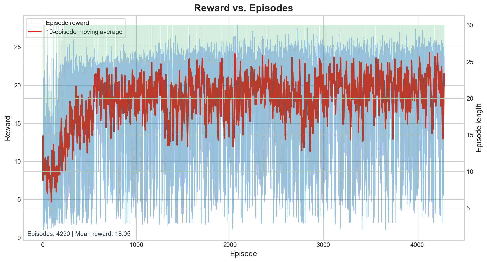

# Autonomous Driving Agent with PPO


## Overview

This project implements a CPU-friendly autonomous driving agent for the `highway-fast-v0` environment using Gymnasium, `highway-env`, and Stable-Baselines3 (PPO). The pipeline is fully operational: the training script logs episode statistics using `Monitor`, saves a midpoint checkpoint, and persists the final policy. The evaluation script then generates an evolution GIF and a reward plot in the `assets/` directory.

## Methodology

The policy is optimized using a compact multi-objective reward function that encourages forward progress while strongly penalizing unsafe behavior:

$$
R_t = 0.4\,\hat{v}_t - 1.0\,\mathbb{1}(\text{collision}_t) + 0.2\,\\$\mathbb{1}(\text{lane-stable}_t)$ - 0.1\,\lvert \Delta a_t \rvert
$$

Here, $\hat{v}_t$ is the normalized speed, $\mathbb{1}(\text{collision}_t)$ is a collision penalty, $\mathbb{1}(\text{lane\_stable}_t)$ rewards steady lane discipline, and $\lvert \Delta a_t \rvert$ discourages unnecessary action switching. The weighting is intentionally safety-biased, ensuring the agent prefers stable traffic handling over aggressive lane changes.

PPO is a strong fit for this environment because the control problem is discrete, the state space is structured, and the hardware target is CPU-only. The clipped policy update improves stability, the rollout-based training loop keeps memory usage predictable, and the method remains reliable under the stochastic traffic generation of `highway-env`.

The key hyperparameters are chosen for stable learning rather than raw aggressiveness:

* **`learning_rate = 5e-4`**: Keeps updates controlled on the CPU.
* **`gamma = 0.8`**: Prioritizes near-term safety and reduces reward-horizon drift.
* **`n_steps = 1024`**: Provides a useful rollout batch without excessive memory pressure.
* **`batch_size = 64`**: Maintains efficient minibatch updates.

## Observation and Action Spaces

The environment uses a kinematic observation representation instead of raw pixels. In practice, the policy receives a compact numerical encoding of nearby traffic, including relative positions, velocities, and lane context around the ego vehicle. This structure is a good match for PPO because it is easy to process, lightweight on the CPU, and expressive enough for lane selection and collision avoidance.

The action space is discrete and corresponds to core highway-driving decisions: lane changes and speed control. This keeps the learning problem tractable while forcing the agent to manage the essential trade-off between speed, spacing, and safety.

## Training Analysis



The reward curve should be interpreted as a stability trace rather than a simple upward trend. Early episodes usually show high variance because the agent is still learning traffic dynamics. As PPO updates accumulate, the moving average smooths out, and the spread between episodes narrows. This is a practical indicator that the policy is becoming safer and more consistent.

A healthy training run typically follows this pattern: large oscillations at the start, reduced crash frequency in the middle, and longer, more stable episodes later on. In a driving task, lower variance is often more important than isolated reward spikes, as stable trajectories indicate fewer abrupt lane changes and terminal collisions.

## Challenges and Failures

The main early failure mode was cascading crashes. After a single unsafe maneuver, the policy often continued to swerve or brake aggressively, compounding the mistake into a sequence of collisions. The most effective fix was reducing the discount factor (`gamma`) to `0.8`, forcing the agent to prioritize immediate safety consequences instead of overvaluing delayed rewards.

This adjustment significantly improved the driving style. The agent became less willing to gamble on risky lane switches, recovered more cleanly after near-misses, and learned to treat the immediate next few seconds as the most critical part of the trajectory.

Evaluation uses deterministic inference for the learned policies. This removes sampling noise when comparing the half-trained and final checkpoints, making the evolution GIF easier to interpret.

## Outputs

* `checkpoints/ppo_highway_half_trained.zip`
* `checkpoints/ppo_highway_final.zip`
* `logs/monitor.csv`
* `assets/evolution.gif`
* `assets/reward_plot.png`

## Run Instructions

```bash
pip install -r requirements.txt
python -m src.train
python -m src.evaluate